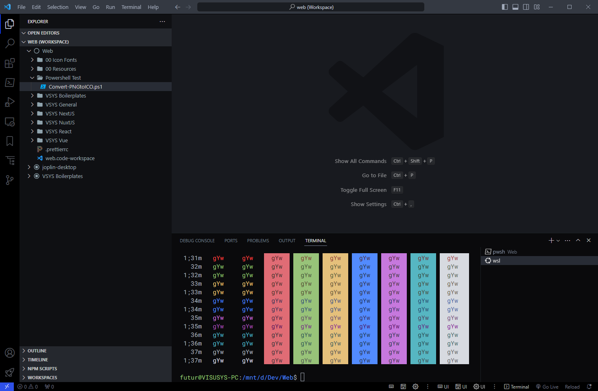
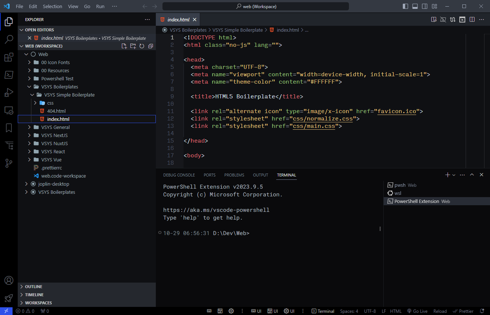
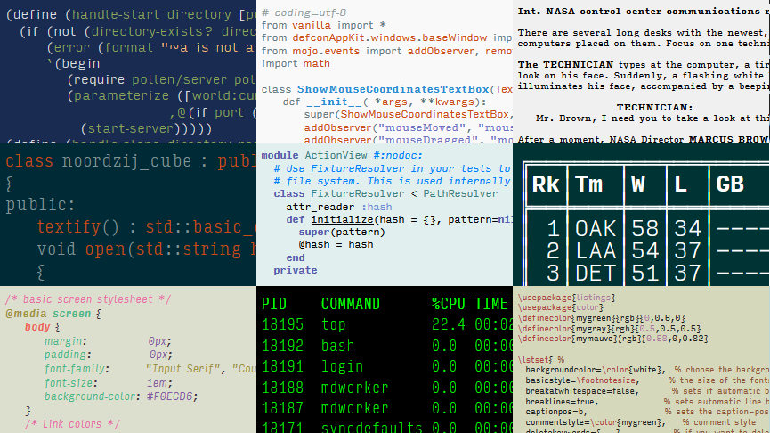

# VSCode: Tidal Dark Theme

This is a sleek and dark VS Code theme.

 

## Version

**v1.0.0** - 10-29-2023 - Initial Release

## Screenshots

## Recommended Extensions

| Extension | Marketplace URL |
| --- | --- |
| **Material Icon Theme** | https://marketplace.visualstudio.com/items?itemName=PKief.material-icon-theme |
| **Activitusbar** | https://marketplace.visualstudio.com/items?itemName=Gruntfuggly.activitusbar |
| **Better Align** | https://marketplace.visualstudio.com/items?itemName=Chouzz.vscode-better-align |
| **Bracketeer** | https://marketplace.visualstudio.com/items?itemName=pustelto.bracketeer |
| **Microsoft Live Server** | https://marketplace.visualstudio.com/items?itemName=ms-vscode.live-server |
| **LiveServer** | https://marketplace.visualstudio.com/items?itemName=ritwickdey.LiveServer |
| **Prettier** | https://marketplace.visualstudio.com/items?itemName=esbenp.prettier-vscode |
| **Reload** | https://marketplace.visualstudio.com/items?itemName=natqe.reload |
| **Snippets Viewer** | https://marketplace.visualstudio.com/items?itemName=RandomFractalsInc.snippets-viewer |
    

## Recommended Typeface: [Input Mono](https://input.djr.com/)

> [Download Input Mono Here](https://input.djr.com/download/)

